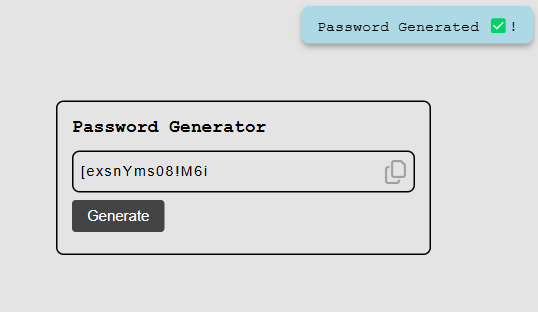
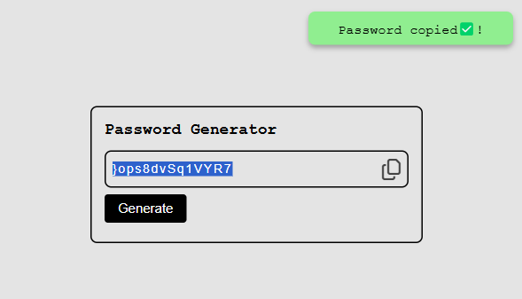
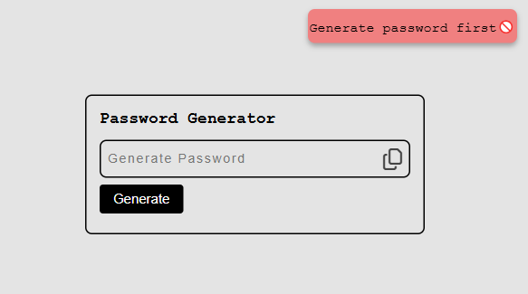

# Random Password Generator 🔒

A secure and user-friendly password generator that creates strong, random passwords with customizable options.
## Demo
[Live Demo](https://paulmagadi.github.io/random-password-generator/)

---
#### Password Generate Sucess
 
---
#### Password Copy Sucess
 
---
#### Password Generate Error
 

## Features ✨

- Generates strong, random passwords up to 50 characters
- Copy to clipboard with one click
- Visual feedback when password is copied
- Responsive design works on all devices
- Clean, intuitive interface

## How It Works ⚙️

1. Click the "Generate" button to create a new password
2. The password appears in the display field
3. Click the copy icon to copy the password to your clipboard
4. A notification confirms the password was copied

## Customization Options 🛠️

The generator creates passwords using:
- Uppercase letters (A-Z)
- Lowercase letters (a-z)
- Numbers (0-9)
- Special characters (!@#$%^&* etc.)

**Default password length: 14 characters**

## Installation 📥

No installation required! Simply open `index.html` in your web browser.

For local development:

```bash
git clone https://github.com/paulmagadi/random-password-generator
cd password-generator
```

open index.html

## Technologies Used 💻
- HTML5

- CSS3

- JavaScript (ES6)

## Browser Support 🌐
- Chrome	✅ Yes
- Firefox	✅ Yes
- Safari	✅ Yes
- Edge	✅ Yes
- IE 11	❌ No

## Contributing 🤝
Contributions are welcome! Please follow these steps:

1. Fork the project

2. Create your feature branch (git checkout -b feature/AmazingFeature)

3. Commit your changes (git commit -m 'Add some amazing feature')

4. Push to the branch (git push origin feature/AmazingFeature)

5. Open a Pull Request

## License 📜
This project is free for use under the MIT License - see the LICENSE file for details.

## Acknowledgements 🙏
- [Font Awesome](https://fontawesome.com/) for the copy icon

- [Emojipedia](emojipedia.org) for the emojis used in this documentation

## 🙋‍♂️ Author
**Paul Magadi** | [#paummagadi](https://github.com/paulmagadi)


Inspired by various password managers and generators

